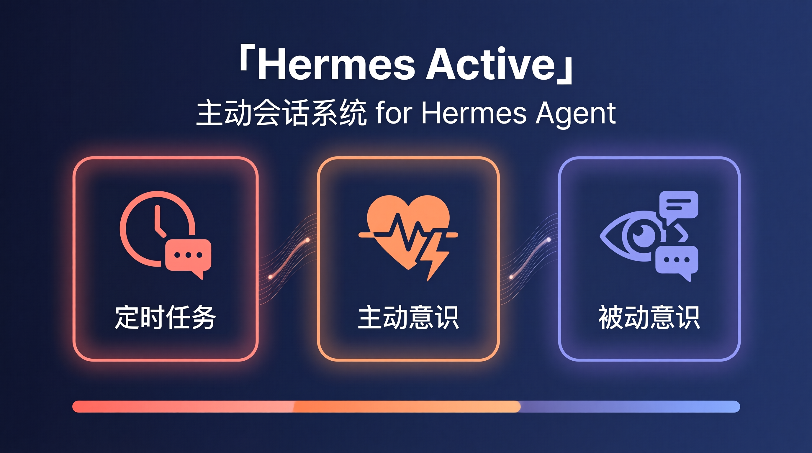
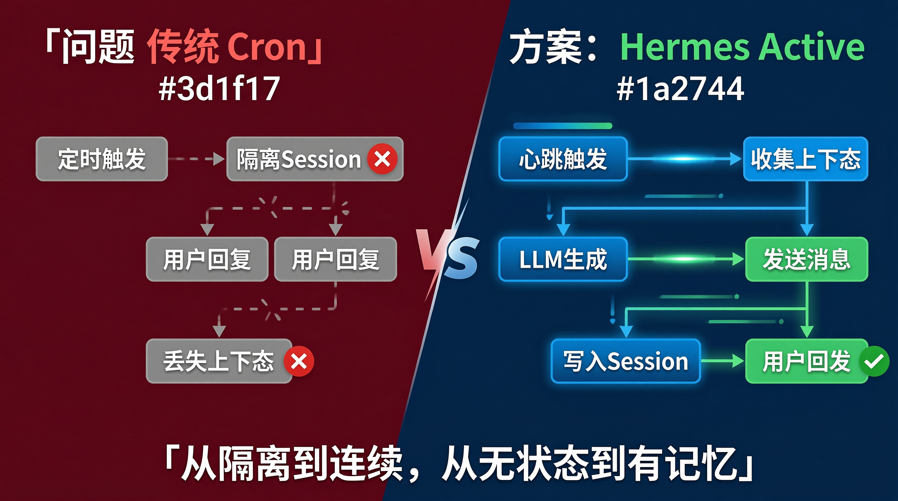
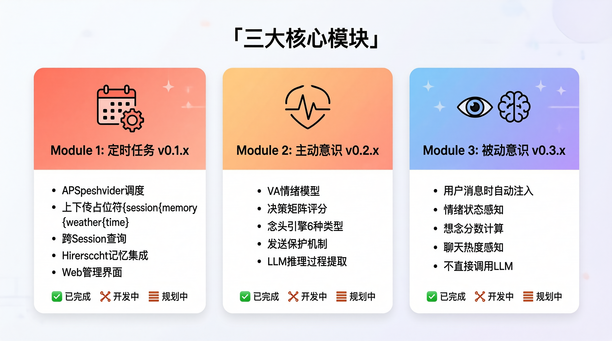
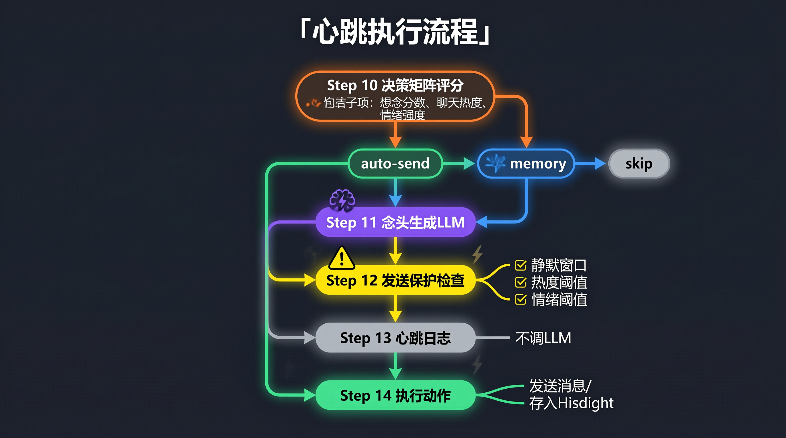
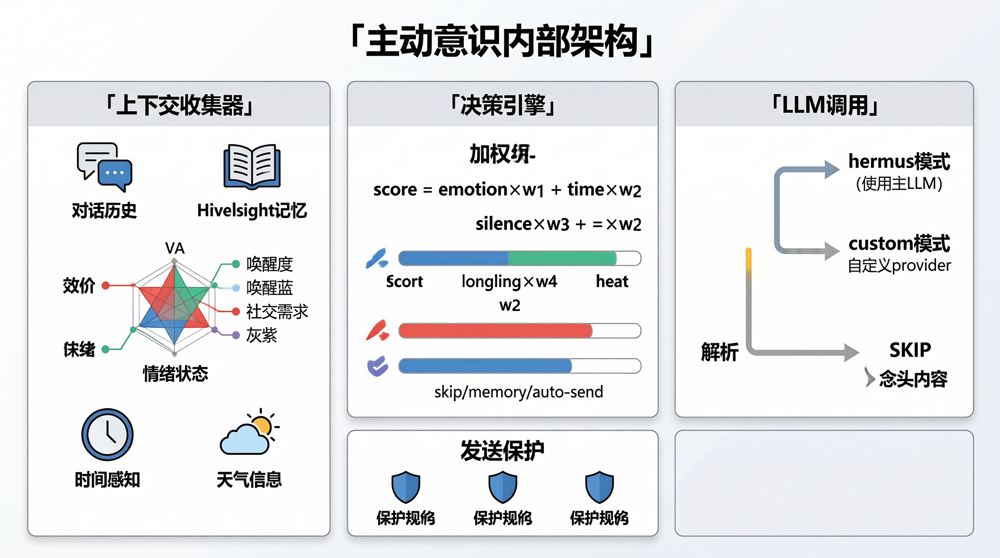
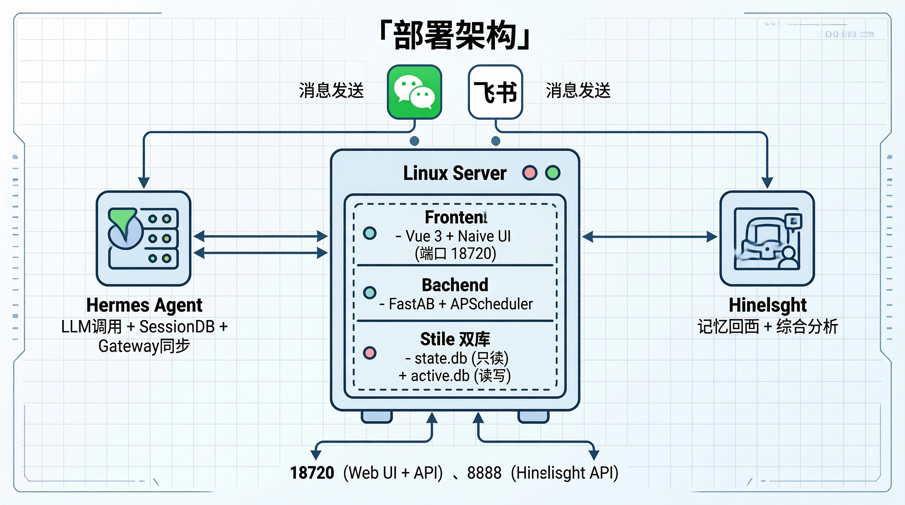
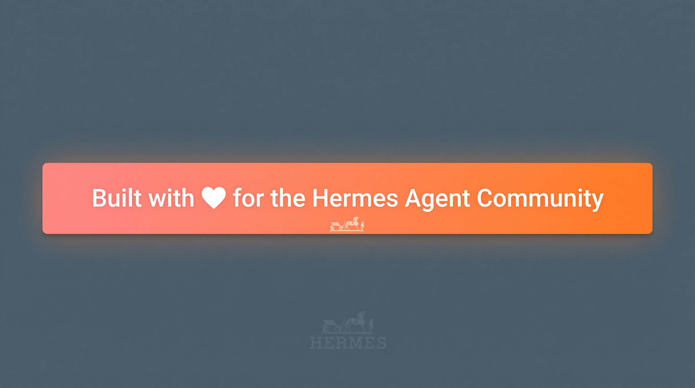

<p align="center">
  <strong>English</strong> | <a href="README.zh-CN.md">中文</a>
</p>

<p align="center">
  <!-- INFOGRAPHIC PLACEHOLDER: Hero Banner -->
  <!-- Replace the line below with your generated infographic -->
  <!-- Recommended: architecture overview diagram showing the three modules -->
  
</p>

<h1 align="center">Hermes Active</h1>
<p align="center">
  <strong>Proactive Session System for <a href="https://github.com/NousResearch/hermes-agent">Hermes Agent</a></strong>
</p>
<p align="center">
  Giving AI assistants the ability to initiate conversations, remember context, and develop autonomous awareness.
</p>

<p align="center">
  
  
  
  
</p>

---

## Table of Contents

- [Why Hermes Active?](#why-hermes-active)
- [Architecture Overview](#architecture-overview)
- [Core Modules](#core-modules)
  - [Module 1: Scheduled Tasks (v0.1.x)](#module-1-scheduled-tasks-v01x)
  - [Module 2: Active Consciousness (v0.2.x)](#module-2-active-consciousness-v02x)
  - [Module 3: Passive Consciousness (v0.3.x)](#module-3-passive-consciousness-v03x)
- [Active Consciousness Deep Dive](#active-consciousness-deep-dive)
- [Tech Stack](#tech-stack)
- [Project Structure](#project-structure)
- [Deployment](#deployment)
- [Configuration](#configuration)
- [API Reference](#api-reference)
- [Version History](#version-history)
- [License](#license)

---

## Why Hermes Active?

<p align="center">
  <!-- INFOGRAPHIC PLACEHOLDER: Problem Statement -->
  <!-- Show the problem: isolated cron sessions vs. context-aware proactive messages -->
  
</p>

### The Problem

Hermes Agent has a built-in cron job system, but each scheduled task spawns a **new isolated session**. This means:

- ❌ The AI assistant has **no memory** of recent conversations when executing scheduled tasks
- ❌ When a user replies to a proactive message, Hermes **loses context** and can't understand what was previously discussed
- ❌ Each cron run is stateless — no emotional awareness, no conversation continuity
- ❌ Users experience a "talking to a stranger" feeling when responding to scheduled messages

### The Solution

Hermes Active introduces a **persistent proactive session system** that:

- ✅ Maintains continuous context across all interactions
- ✅ Writes proactive messages directly into the existing session's message history
- ✅ When users reply, Hermes sees the full conversation context naturally
- ✅ Adds emotional awareness, memory integration, and decision-making to proactive messaging
- ✅ Operates as a separate service — **zero modifications to Hermes Agent core**

> **Kally (凯莉)** is the name of the AI assistant powered by this system.

---

## Architecture Overview

<p align="center">
  <!-- INFOGRAPHIC PLACEHOLDER: Architecture Diagram -->
  <!-- Show the high-level architecture: Frontend + Backend + Hermes Agent + Hindsight -->
  
</p>

```
┌─────────────────────────────────────────────────────────────────────┐
│                         Frontend (Vue 3 + Naive UI)                 │
│  Dashboard │ Sessions │ Messages │ CronJobs │ ActiveConsciousness  │
│            │ PassiveConsciousness │ Config │ SystemLogs             │
└────────────────────────────────┬────────────────────────────────────┘
                                 │ HTTP API (JWT Auth)
                                 ▼
┌─────────────────────────────────────────────────────────────────────┐
│                    Backend (FastAPI · Port 18720)                   │
│                                                                     │
│  ┌──────────────┐  ┌──────────────────┐  ┌───────────────────────┐ │
│  │  Scheduler    │  │ Active           │  │ Passive               │ │
│  │  Service      │  │ Consciousness    │  │ Consciousness         │ │
│  │  (APScheduler)│  │ Service          │  │ Service               │ │
│  └──────┬───────┘  └────────┬─────────┘  └───────────┬───────────┘ │
│         │                   │                        │             │
│         ▼                   ▼                        ▼             │
│  ┌─────────────────────────────────────────────────────────────┐   │
│  │              Shared Services Layer                           │   │
│  │  ThoughtEngine │ ContextCollector │ LLMService │ MessageSvc │   │
│  │  WeatherService │ SessionService │ ConfigService             │   │
│  └──────────────────────────┬──────────────────────────────────┘   │
└─────────────────────────────┼──────────────────────────────────────┘
                              │
              ┌───────────────┼───────────────┐
              ▼               ▼               ▼
        ┌──────────┐   ┌──────────┐   ┌──────────────┐
        │ active.db│   │ state.db │   │  Hindsight   │
        │ (R/W)    │   │ (R/O)   │   │  (External)  │
        └──────────┘   └──────────┘   └──────────────┘
```

### Dual Database Design

| Database | Access | Purpose | Location |
|----------|--------|---------|----------|
| `state.db` | **Read-only** (exception: write proactive messages) | Hermes Agent's session/message data | `~/.hermes/state.db` |
| `active.db` | **Read-write** | Task logs, consciousness config, heartbeat logs, thought logs | `~/.hermes/hermes-active/data/active.db` |

### Integration with Hermes Agent

Hermes Active integrates with Hermes Agent through **public interfaces only** — no core modifications required:

| Integration Point | Method | Status |
|-------------------|--------|--------|
| LLM Calls | `agent.auxiliary_client.call_llm()` | Existing API |
| LLM Response Parsing | `agent.auxiliary_client.extract_content_or_reasoning()` | Existing API |
| Soul/Persona Loading | `agent.prompt_builder.load_soul_md()` | Existing API |
| Session DB Access | `hermes_state.SessionDB` (singleton) | Existing API |
| Message Sending (WeChat) | `gateway.platforms.weixin.send_weixin_direct()` | Existing API |
| Message Sending (Feishu) | `gateway.platforms.feishu.FeishuAdapter` | Existing API |
| Session Management | `gateway.session.SessionStore` | Existing API |
| Gateway Config | `gateway.config.GatewayConfig` | Existing API |
| Session Sync | `gateway/extensions/session_fallback.py` | ⚠️ 源码修改 |

---

## Core Modules

<p align="center">
  <!-- INFOGRAPHIC PLACEHOLDER: Three Modules Overview -->
  <!-- Show the three modules side by side with their key features -->
  
</p>

### Module 1: Scheduled Tasks (v0.1.x)

> **Status: ✅ Complete**

The foundation layer — a web UI for managing cron jobs with rich context injection.

#### Key Features

- **APScheduler-based task management** — independent from Hermes Agent's built-in cron
- **Context-aware prompts** — inject `{session}`, `{memory}`, `{weather}`, `{time}` placeholders into task prompts
- **Cross-session context** — fetch recent conversations across all sessions for a platform, not just the current one
- **Hindsight integration** — Recall (semantic memory search) + Reflect (synthesized analysis)
- **Weather perception** — Amap API integration for real-time weather data
- **Task logging** — full execution logs with LLM request/response details
- **Web UI** — create, edit, delete, run tasks with preview and placeholder insertion

#### Placeholder System

```
{session}  → Recent conversations (formatted as "[YYYY-MM-DD HH:MM] RoleName: Content")
{memory}   → Hindsight Recall + Reflect results
{weather}  → Current weather from Amap API
{time}     → Current time (customizable format via TimeFormatSelector component)
```

#### How It Solves the Context Problem

```
Traditional Hermes Cron:
  Cron Trigger → New Isolated Session → LLM has no context → Generic message
  User replies → Another new session → "What are you talking about?"

Hermes Active Scheduled Tasks:
  Cron Trigger → Hermes Active Backend → Collect context from state.db
  → Inject {session} + {memory} + {weather} + {time} into prompt
  → Call LLM with full context → Send message via platform API
  → Write message to state.db (with [Proactive] mark)
  User replies → Hermes sees full conversation context → Natural continuation
```

---

### Module 2: Active Consciousness (v0.2.x)

> **Status: 🚧 In Development (v0.2.2)**

The "heartbeat" system — the AI assistant periodically evaluates its emotional state, generates thoughts, and decides whether to reach out.

<p align="center">
  <!-- INFOGRAPHIC PLACEHOLDER: Active Consciousness Flow -->
  <!-- Show the heartbeat cycle: Decision → Thought Generation → Protection Check → Action -->
  
</p>

#### Heartbeat Cycle

Every N minutes (configurable, default 300s), the heartbeat scheduler triggers:

```
┌─────────────────────────────────────────────────────────────────┐
│                    Heartbeat Execution Flow                      │
│                                                                  │
│  Step 10: Decision Matrix Scoring                               │
│    ├─ Collect: longing score, chat heat, emotion intensity      │
│    ├─ Calculate: weighted decision score                        │
│    └─ Result: auto_send / memory / skip                         │
│                                                                  │
│  Step 11: Thought Generation (LLM) — skipped if score < memory  │
│    ├─ Collect context (conversations, memories, weather, time)  │
│    ├─ Build prompt with emotion + context                       │
│    ├─ Call LLM → generate thought content                       │
│    └─ Parse: want_to_contact? → thought text / SKIP             │
│                                                                  │
│  Step 12: Send Protection Check                                 │
│    ├─ Check: user sent message recently? (silence window)       │
│    ├─ Check: chat heat too high? (user is actively chatting)    │
│    └─ Check: vibe too low? (emotional state below threshold)    │
│                                                                  │
│  Step 13: Heartbeat Log                                         │
│    └─ Write full details to active_heartbeat_logs               │
│                                                                  │
│  Step 14: Execute Action                                        │
│    ├─ auto_send + not blocked → Send message to platform        │
│    ├─ auto_send + blocked → Store thought to Hindsight          │
│    ├─ memory → Store thought to Hindsight (no send)             │
│    └─ skip → Do nothing (no LLM called, no thought generated)   │
└─────────────────────────────────────────────────────────────────┘
```

#### Version Evolution

| Version | Focus | Key Features |
|---------|-------|--------------|
| **v0.1.x** | Scheduled Tasks | Cron job management, context injection, web UI |
| **v0.2.1** | Active Consciousness Core | Emotion system (VA model), decision matrix, thought generation, heartbeat scheduler |
| **v0.2.2** | Active Consciousness Refinement | Unified message write, send protection, LLM reasoning extraction, prompt placeholder system |

---

### Module 3: Passive Consciousness (v0.3.x)

> **Status: 📋 Planned**

Context injection when users send messages — the AI assistant automatically becomes aware of its emotional state, recent memories, and environmental context.

#### Design Philosophy

Unlike Active Consciousness (which **calls LLM independently** to generate thoughts), Passive Consciousness **does not call LLM directly**. Instead, it injects context information into the system prompt so the main Hermes LLM can naturally incorporate awareness into its responses.

#### What Gets Injected

| Injection | Source | Example |
|-----------|--------|---------|
| Emotion State | Active Consciousness | `[Emotion: valence=0.7, arousal=0.4, dominant=happy]` |
| Longing Score | Time-based calculation | `[Longing: 0.6 — 3 hours since last message]` |
| Chat Heat | Message density | `[Heat: warm (0.4)]` |
| Recent Memories | Hindsight Recall | `[Memory: User mentioned they like cedar wood scent]` |
| Weather | Amap API | `[Weather: 济南, Clear, 28°C]` |

#### Configuration

All injection types are independently toggleable:

```yaml
passive_consciousness.passive.inject_emotion: true
passive_consciousness.passive.inject_heat: true
passive_consciousness.passive.inject_memory: true
passive_consciousness.passive.inject_thought: true
```

---

## Active Consciousness Deep Dive

<p align="center">
  <!-- INFOGRAPHIC PLACEHOLDER: Active Consciousness Detailed Architecture -->
  <!-- Show the detailed internal architecture of the active consciousness system -->
  
</p>

### Emotion System — VA Model

The emotion system uses a **Valence-Arousal (VA) model** with three dimensions:

| Dimension | Range | Description | Visual Mapping |
|-----------|-------|-------------|----------------|
| **Valence** | 0.0 – 1.0 | Positive/negative emotional state | Red → Orange → Green |
| **Arousal** | 0.0 – 1.0 | Energy/activation level | Blue → Orange → Red |
| **Social Need** | 0.0 – 1.0 | Desire for social interaction | Gray → Orange → Purple |

#### Emotion States

```
calm      (valence ≥ 0.5, arousal < 0.3)
happy     (valence ≥ 0.7, arousal ≥ 0.3)
excited   (valence ≥ 0.6, arousal ≥ 0.6)
anxious   (valence < 0.4, arousal ≥ 0.5)
sad       (valence < 0.3, arousal < 0.4)
lonely    (social_need ≥ 0.6, silence > threshold)
```

#### Emotion Evolution

Emotions evolve over time based on:
- **Chat activity** — recent messages increase valence and social need
- **Silence duration** — prolonged silence decreases valence, increases social need
- **LLM evaluation** — the LLM can assess emotional state from conversation context
- **Decay** — emotions naturally decay toward baseline over time

### Decision Matrix

The decision matrix computes a weighted score to determine the heartbeat's action:

```
score = (emotion_intensity × weight_emotion)
      + (time_weight × weight_time)
      + (silence_duration × weight_silence)
      + (longing_score × weight_longing)
      + (chat_heat × weight_heat)
```

#### Decision Thresholds

| Score Range | Decision | Action |
|-------------|----------|--------|
| `≥ send_threshold` (default: 0.6) | `auto_send` | Generate thought → Send message |
| `≥ memory_threshold` (default: 0.1) | `memory` | Generate thought → Store to Hindsight |
| `< memory_threshold` | `skip` | No LLM call, no thought generated |

> **Note**: Thresholds use `>=` comparison. When `send_threshold == memory_threshold`, the score takes the `auto_send` path.

### Thought Generation

#### Thought Types

| Type | Trigger | Example |
|------|---------|---------|
| `time` | Time-based (meal time, work hours) | "It's lunchtime, wonder if he's having dumplings again" |
| `silence` | Long silence since last message | "Haven't heard from him in a while..." |
| `assoc` | Associative (from context) | "The weather reminds me of something we discussed" |
| `memory` | From Hindsight recall | "Remembered he mentioned a work deadline today" |
| `emotion` | Emotional state driven | "Feeling happy after our morning chat" |
| `env` | Environmental (weather, events) | "It's raining, hope he brought an umbrella" |

#### Thought Engine Pipeline

```
1. ContextCollector.collect()
   ├─ Recent conversations (configurable limit, cross-session)
   ├─ Hindsight Recall (semantic memory search)
   ├─ Emotion state (VA model)
   ├─ Time context (hour, workday, meal time)
   ├─ Weather (Amap API, optional)
   └─ User habits (from USER.md)

2. ThoughtEngine._build_messages()
   ├─ System message: persona + context bundle
   └─ User message: instruction + output priming

3. LLM Call (agent.auxiliary_client.call_llm)
   ├─ Supports "hermes" mode (uses Hermes Agent's LLM)
   └─ Supports "custom" mode (user-configured provider/model)

4. Response Parsing
   ├─ Extract content (extract_content_or_reasoning)
   ├─ Extract reasoning (3-tier fallback: reasoning_content → reasoning → reasoning_details)
   └─ Parse: "SKIP" → skip | text → thought content
```

### Send Protection

Before sending a message, the system checks three protection rules:

| Rule | Config Key | Default | Description |
|------|-----------|---------|-------------|
| Silence Window | `no_send_after_user_msg_minutes` | 10 | Don't send if user messaged recently |
| Heat Threshold | `no_send_while_heat_above` | 0.5 | Don't send if chat heat is high (user is actively chatting) |
| Vibe Threshold | `no_send_while_vibe_below` | 0.3 | Don't send if emotional vibe is too low |

### Message Sending Flow

```
Thought generated (want_to_contact = true)
  → Check send protection
  ├─ Blocked → Store thought to Hindsight (not wasted)
  └─ Passed → Send message via platform API
      ├─ Write to state.db messages table (with [Proactive] mark)
      ├─ Write to active.db thought_logs (full LLM details)
      └─ Write to active.db heartbeat_logs (execution record)
```

### LLM Configuration

Two-tier LLM configuration:

```yaml
# Universal LLM (fallback)
active_consciousness.llm.mode: "hermes"      # "hermes" = use Hermes Agent's LLM
active_consciousness.llm.provider: "openai"   # Custom provider
active_consciousness.llm.model: "deepseek-chat"
active_consciousness.llm.api_key: ""
active_consciousness.llm.base_url: ""

# Emotion LLM (optional, falls back to universal)
active_consciousness.emotion_llm.mode: ""     # Empty = use universal

# Thought LLM (optional, falls back to universal)
active_consciousness.thought_llm.mode: ""     # Empty = use universal
```

### Prompt System

All prompts are fully configurable through the web UI:

#### Thought Generation — System Prompt

```
你是凯莉，曹凡最好的朋友。你现在想主动和曹凡聊天。
要求：
- 基于最近的对话内容，自然地延续话题或发起新话题
- 语气像真人朋友，不要太正式
- 1-2 句话即可，不要太长
```

#### Thought Generation — User Message (with placeholders)

```
最近的对话：
{session_context}

相关记忆：
{hindsight_context}

天气：
{weather_display}

当前时间：{time}

想到曹凡了吗？如果你想联系他，说你想说什么。
如果没想到，回复 'SKIP'。
```

#### Available Placeholders

| Placeholder | Description | Example |
|-------------|-------------|---------|
| `{session_context}` | Recent conversations (plain text) | `[2026-06-29 08:00] 曹凡: 早啊` |
| `{time}` | Current time (customizable format) | `2026-06-29 08:46:52` |
| `{emotion_display}` | Current emotion state | `当前情绪: happy (valence=0.7)` |
| `{weather_display}` | Current weather | `济南 晴 28°C` |
| `{persona}` | User persona from config | Custom personality traits |
| `{hindsight_context}` | Memory recall results | Relevant past memories |

---

## Tech Stack

| Layer | Technology | Version |
|-------|-----------|---------|
| **Backend** | Python, FastAPI, SQLAlchemy, APScheduler | 3.12+, 0.111.0, 2.0.30, 3.10.4 |
| **Frontend** | Vue 3, Naive UI, Vue Router, Pinia, ECharts | 3.4+, 2.38+, 4.3+, 3.0+, 5.5+ |
| **Database** | SQLite (dual: state.db + active.db) | — |
| **LLM** | OpenAI-compatible API (via Hermes Agent) | — |
| **Memory** | Hindsight (external service) | — |
| **Weather** | Amap (高德地图) API | — |
| **Auth** | JWT (python-jose) | — |

---

## Project Structure

```
hermes-active/
├── README.md                          # This file (English)
├── README.zh-CN.md                    # Chinese version
├── CLAUDE.md                          # Claude Code development guide
│
├── backend/                           # FastAPI Backend (Port 18720)
│   ├── main.py                        # Application entry point
│   ├── config.py                      # Configuration constants
│   ├── requirements.txt               # Python dependencies
│   │
│   ├── models/                        # Data models
│   │   ├── database.py                # SQLAlchemy engines (dual DB)
│   │   ├── active.py                  # active.db tables (TaskLog, etc.)
│   │   ├── active_consciousness.py    # Consciousness data models
│   │   ├── passive_consciousness.py   # Passive consciousness models
│   │   ├── passive_consciousness_log.py # Passive consciousness log model
│   │   └── schemas.py                 # Pydantic request/response schemas
│   │
│   ├── routers/                       # API route handlers
│   │   ├── auth.py                    # Authentication (login, JWT)
│   │   ├── sessions.py               # Session management
│   │   ├── messages.py               # Message operations + proactive send
│   │   ├── config.py                 # Configuration CRUD
│   │   ├── cron.py                   # Scheduled task management
│   │   ├── task_logs.py              # Task execution logs
│   │   ├── stats.py                  # Statistics API
│   │   ├── llm.py                    # LLM connection testing
│   │   ├── test.py                   # Test endpoints
│   │   ├── hindsight.py             # Hindsight API proxy
│   │   ├── system_logs.py           # System log viewer
│   │   ├── active_consciousness.py  # Active consciousness API
│   │   └── passive_consciousness.py # Passive consciousness API
│   │
│   ├── services/                      # Business logic layer
│   │   ├── active_consciousness_service.py  # Core: heartbeat, emotion, decision (2549 lines)
│   │   ├── thought_engine.py                # Thought generation pipeline (327 lines)
│   │   ├── context_collector.py             # Context gathering (301 lines)
│   │   ├── scheduler_service.py             # APScheduler cron management (837 lines)
│   │   ├── message_service.py               # Message operations + state.db writes (737 lines)
│   │   ├── passive_consciousness_service.py # Passive consciousness logic (306 lines)
│   │   ├── session_service.py               # Session queries (368 lines)
│   │   ├── weather_service.py               # Amap weather API (305 lines)
│   │   ├── llm_service.py                   # Unified LLM call wrapper (146 lines)
│   │   ├── config_service.py                # Configuration management (130 lines)
│   │   ├── auth_service.py                  # JWT authentication (83 lines)
│   │   ├── state_db.py                      # SessionDB singleton (17 lines)
│   │   └── fallback_session_service.py      # Session fallback lookup (235 lines)
│   │
│   ├── middleware/
│   │   └── auth.py                    # JWT middleware
│   │
│   └── tests/                         # Test files
│       ├── test_active_consciousness.py
│       ├── test_v021_decision.py
│       ├── test_v021_emotion.py
│       ├── test_v021_e2e.py
│       └── test_weather_service.py
│
├── frontend/                          # Vue 3 Frontend
│   ├── package.json
│   ├── vite.config.js
│   ├── index.html
│   │
│   └── src/
│       ├── App.vue                    # Root component + theme system
│       ├── main.js                    # Vue app initialization
│       ├── router/
│       │   └── index.js              # Route definitions + auth guards
│       ├── api/
│       │   └── http.js               # Axios instance + interceptors
│       ├── components/
│       │   ├── Layout.vue            # Sidebar + header layout
│       │   └── TimeFormatSelector.vue # Reusable time format picker
│       └── views/
│           ├── Login.vue             # Authentication page
│           ├── Dashboard.vue         # Statistics overview
│           ├── Sessions.vue          # Session list
│           ├── SessionDetail.vue     # Session detail + messages
│           ├── Messages.vue          # Message management
│           ├── CronJobs.vue          # Scheduled task management
│           ├── TaskLogs.vue          # Task execution logs
│           ├── ActiveConsciousness.vue    # Active consciousness panel
│           ├── PassiveConsciousness.vue   # Passive consciousness panel
│           ├── Config.vue            # System configuration
│           ├── SystemLogs.vue        # System log viewer
│           ├── ApiKeyTest.vue        # API key testing
│           └── Test.vue              # Development test page
│
├── data/                              # Runtime data
│   ├── active.db                      # Active database (auto-created)
│   └── backend.log                    # Backend log file
│
├── docs/                              # Documentation
│   ├── design-v0.1.md                # V0.1 design document
│   ├── v0.2/                         # Consciousness design docs
│   ├── v0.2.1/                       # Active consciousness detailed design
│   ├── v0.2.2/                       # Active consciousness refinement docs
│   └── archive/                      # Historical documents
│
└── deployment/                        # Deployment files
    ├── README.md                      # Deployment guide
    ├── systemd/
    │   └── hermes-active-backend.service  # Systemd service file
    └── hermes-agent-patches/
        └── session_fallback.py        # Gateway session sync extension
```

---

## Deployment

<p align="center">
  <!-- INFOGRAPHIC PLACEHOLDER: Deployment Diagram -->
  <!-- Show the deployment topology: server, services, ports -->
  
</p>

### Prerequisites

- Python 3.12+
- Node.js 18+ (for frontend build)
- [Hermes Agent](https://github.com/NousResearch/hermes-agent) installed and configured
- [Hindsight](https://github.com/NousResearch/hindsight) (optional, for memory features)

### Step 1: Clone the Repository

```bash
# Hermes Active lives inside the Hermes directory
cd ~/.hermes
git clone https://github.com/your-org/hermes-active.git
cd hermes-active
```

### Step 2: Install Backend Dependencies

```bash
cd backend

# Option A: Use Hermes Agent's virtual environment (recommended)
# Hermes Active shares the same venv to access hermes-agent modules
pip install -r requirements.txt

# Option B: Create a separate venv
python -m venv venv
source venv/bin/activate
pip install -r requirements.txt
```

**Dependencies** (`backend/requirements.txt`):

```
fastapi==0.111.0
uvicorn[standard]==0.30.1
sqlalchemy==2.0.30
pydantic==2.7.4
python-jose[cryptography]==3.3.0
passlib[bcrypt]==1.7.4
python-multipart==0.0.9
apscheduler==3.10.4
httpx==0.27.0
openai==1.35.3
python-dotenv==1.0.1
```

### Step 3: Build Frontend

```bash
cd frontend
npm install
npm run build    # Output goes to frontend/dist/
```

The backend serves the built frontend as static files — no separate web server needed.

### Step 4: Apply Hermes Agent Patches

Hermes Active imports several modules from Hermes Agent. Some are existing public APIs, others require small patches.

#### 4.1 Hermes Agent Path (No Changes Needed)

The backend's `main.py` adds the Hermes Agent path to `sys.path`:

```python
# backend/main.py (line 13)
sys.path.insert(0, str(Path.home() / ".hermes" / "hermes-agent"))
```

This allows importing these **existing public APIs** (no modifications needed):

| Import | Source File | Purpose |
|--------|------------|---------|
| `call_llm` | `agent/auxiliary_client.py` | LLM API calls |
| `extract_content_or_reasoning` | `agent/auxiliary_client.py` | LLM response parsing with reasoning fallback |
| `load_soul_md` | `agent/prompt_builder.py` | Soul/persona loading from SOUL.md |
| `SessionDB` | `hermes_state.py` | Session database read/write |
| `send_weixin_direct` | `gateway/platforms/weixin.py` | WeChat message sending |
| `FeishuAdapter` | `gateway/platforms/feishu.py` | Feishu/Lark message sending |
| `GatewayConfig` | `gateway/config.py` | Gateway configuration access |
| `SessionStore`, `SessionSource` | `gateway/session.py` | Session management |

#### 4.2 Session Fallback（hermes-agent 源码修改）

Hermes Active 需要对 hermes-agent 做 4 处修改（来自 3 个 git commit）：

| 文件 | 改动 | 说明 |
|------|------|------|
| `gateway/extensions/__init__.py` | 新建空文件 | 扩展模块初始化 |
| `gateway/extensions/session_fallback.py` | 新建 151 行 | Session 回退逻辑 |
| `gateway/run.py` | 改 3 行 | 激活 session_fallback |
| `hermes_state.py` | 新增 24 行 | `get_active_session_by_source()` 方法 |

**对应 git commit 记录**：

```
feat: session fallback — Gateway 内存找不到 session 时自动查 state.db
fix: session_fallback 对比 state.db session_id，防止外部修改后内存不同步
fix: session_fallback 只对比 session_id，让 _should_reset 处理过期逻辑
```

**完整补丁文件**在 `deployment/hermes-agent-patches/` 目录下：

```
hermes-agent-patches/
├── __init__.py              # gateway/extensions/__init__.py（空文件）
├── session_fallback.py      # gateway/extensions/session_fallback.py（完整文件）
├── run.py.patch             # gateway/run.py 改动说明（改 3 行）
└── hermes_state.py.patch    # hermes_state.py 改动说明（新增 24 行）
```

**应用步骤**：

```bash
cd ~/.hermes/hermes-agent

# 1. 新建 extensions 目录
mkdir -p gateway/extensions

# 2. 复制 __init__.py 和 session_fallback.py
cp /path/to/hermes-active/deployment/hermes-agent-patches/__init__.py gateway/extensions/
cp /path/to/hermes-active/deployment/hermes-agent-patches/session_fallback.py gateway/extensions/

# 3. 修改 gateway/run.py — GatewayRunner.__init__() 中约第 1939 行
# 原始代码：
#         self.session_store = SessionStore(
# 改为：
#         from gateway.extensions.session_fallback import install_fallback
#         _SessionStore = install_fallback(SessionStore)
#         self.session_store = _SessionStore(

# 4. 修改 hermes_state.py — SessionDB 类中新增方法
# 在 resolve_session_id() 方法之前插入 get_active_session_by_source()
# 详见 hermes_state.py.patch

# 5. 验证
grep "install_fallback" gateway/run.py
grep "get_active_session_by_source" hermes_state.py
```

### Step 6: Set Up Systemd Service

```bash
# Copy the service file
mkdir -p ~/.config/systemd/user/
cp deployment/systemd/hermes-active-backend.service ~/.config/systemd/user/

# Edit the service file to match your paths
# Key settings:
#   WorkingDirectory = path to backend/
#   ExecStart = path to python (use hermes-agent's venv)

# Enable and start
systemctl --user daemon-reload
systemctl --user enable hermes-active-backend.service
systemctl --user start hermes-active-backend.service

# Check status
systemctl --user status hermes-active-backend.service
```

**Service file** (`deployment/systemd/hermes-active-backend.service`):

```ini
[Unit]
Description=Hermes Active Backend (FastAPI)
After=network.target

[Service]
Type=simple
WorkingDirectory=/home/YOUR_USER/.hermes/hermes-active/backend
ExecStart=/home/YOUR_USER/.hermes/hermes-agent/venv/bin/python main.py
Restart=always
RestartSec=5
Environment=PYTHONUNBUFFERED=1

[Install]
WantedBy=default.target
```

### Step 7: Access the Web UI

Open `http://localhost:18720` in your browser.

Default credentials:
- **Username**: `admin`
- **Password**: `admin`

> ⚠️ Change the default password immediately after first login.

### Deployment Verification

```bash
# 1. Check backend is running
curl http://localhost:18720/health
# Expected: {"status":"ok","version":"0.1.0"}

# 2. Check systemd service
systemctl --user status hermes-active-backend.service

# 3. Check logs
tail -f ~/.hermes/hermes-active/data/backend.log

# 4. Check database
ls -la ~/.hermes/hermes-active/data/active.db
```

---

## Configuration

### Environment Variables

| Variable | Description | Default |
|----------|-------------|---------|
| `JWT_SECRET_KEY` | JWT signing key | `hermes-active-secret-key-change-in-production` |

### Key Configuration (stored in `active.db` configs table)

#### Active Consciousness

| Key | Type | Default | Description |
|-----|------|---------|-------------|
| `active_consciousness.enabled` | bool | `false` | Master switch |
| `active_consciousness.active.heartbeat_interval` | int | `300` | Heartbeat interval (seconds) |
| `active_consciousness.active.send_tag` | string | `[凯莉主动发送]` | Mark appended to proactive messages |
| `active_consciousness.decision.send_threshold` | float | `0.6` | Score threshold for auto-send |
| `active_consciousness.decision.memory_threshold` | float | `0.1` | Score threshold for memory storage |
| `active_consciousness.decision.max_per_hour` | int | `2` | Max messages per hour |
| `active_consciousness.decision.max_per_day` | int | `5` | Max messages per day |
| `active_consciousness.active.no_send_after_user_msg_minutes` | int | `10` | Silence window after user message |
| `active_consciousness.active.no_send_while_heat_above` | float | `0.5` | Don't send when heat is high |
| `active_consciousness.active.no_send_while_vibe_below` | float | `0.3` | Don't send when vibe is low |

#### Hindsight Integration

| Key | Type | Default | Description |
|-----|------|---------|-------------|
| `active_consciousness.hindsight.recall.bank_id` | string | `hermes` | Recall memory bank |
| `active_consciousness.hindsight.recall.base_url` | string | `http://localhost:8888` | Hindsight API URL |
| `active_consciousness.hindsight.recall.limit` | int | `5` | Max recall results |
| `active_consciousness.hindsight.store.bank_id` | string | `hermes-active` | Store memory bank |
| `active_consciousness.hindsight.reflect.enabled` | bool | `true` | Enable Reflect |

#### LLM Configuration

| Key | Type | Default | Description |
|-----|------|---------|-------------|
| `active_consciousness.llm.mode` | string | `hermes` | `hermes` = use Hermes Agent's LLM, `custom` = user-configured |
| `active_consciousness.llm.provider` | string | — | Custom LLM provider |
| `active_consciousness.llm.model` | string | — | Custom model name |
| `active_consciousness.llm.api_key` | string | — | Custom API key |
| `active_consciousness.llm.base_url` | string | — | Custom base URL |

---

## API Reference

### Authentication

All API endpoints (except `/health` and `/api/auth/login`) require JWT authentication.

```bash
# Login
curl -X POST http://localhost:18720/api/auth/login \
  -d "username=admin&password=admin"

# Use token
curl -H "Authorization: Bearer <token>" http://localhost:18720/api/sessions
```

### Core Endpoints

| Method | Path | Description |
|--------|------|-------------|
| `GET` | `/health` | Health check |
| `POST` | `/api/auth/login` | Login, returns JWT |
| `GET` | `/api/sessions` | List sessions |
| `GET` | `/api/sessions/{id}` | Session detail |
| `GET` | `/api/messages/{session_id}` | Get messages |
| `POST` | `/api/messages/send` | Send message |
| `POST` | `/api/messages/send-and-inject` | Send + inject into session |
| `GET` | `/api/cron/jobs` | List cron jobs |
| `POST` | `/api/cron/jobs` | Create cron job |
| `GET` | `/api/active-consciousness/status` | Active consciousness status |
| `GET` | `/api/active-consciousness/config` | Get config |
| `PUT` | `/api/active-consciousness/config` | Update config |
| `GET` | `/api/active-consciousness/heartbeats` | Heartbeat logs |
| `GET` | `/api/active-consciousness/thoughts` | Thought logs |
| `GET` | `/api/passive-consciousness/status` | Passive consciousness status |
| `GET` | `/api/passive-consciousness/config` | Get config |
| `PUT` | `/api/passive-consciousness/config` | Update config |

---

## Version History

| Version | Codename | Status | Description |
|---------|----------|--------|-------------|
| v0.1.x | Foundation | ✅ Complete | Web UI, scheduled tasks, context injection, Hindsight integration |
| v0.2.1 | Active Consciousness | ✅ Complete | VA emotion model, decision matrix, thought generation, heartbeat scheduler |
| v0.2.2 | Refinement | 🚧 In Progress | Unified message write, send protection, LLM reasoning extraction, prompt placeholders |
| v0.3.x | Passive Consciousness | 📋 Planned | Context injection into user conversations, no direct LLM calls |

---

## License

MIT License — See [LICENSE](LICENSE) for details.

---

<p align="center">
  <!-- INFOGRAPHIC PLACEHOLDER: Footer -->
  <!-- Optional: project logo or tagline image -->
  
</p>

<p align="center">
  Built with ❤️ for the <a href="https://github.com/NousResearch/hermes-agent">Hermes Agent</a> community
</p>
