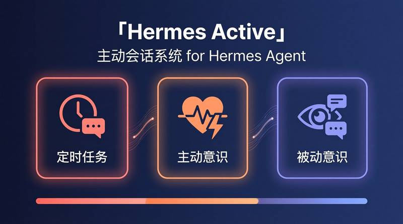
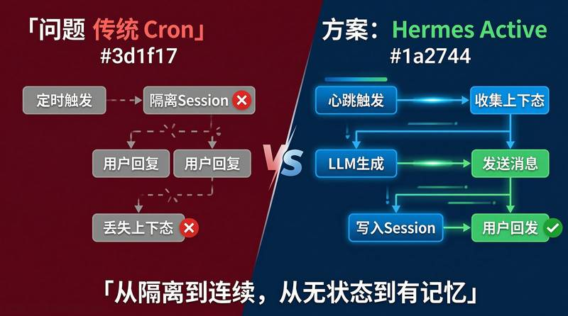
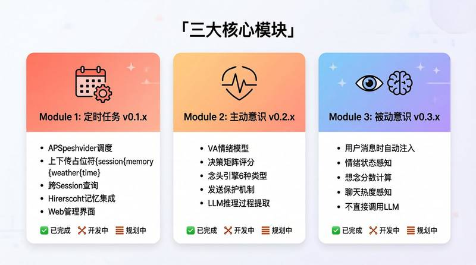
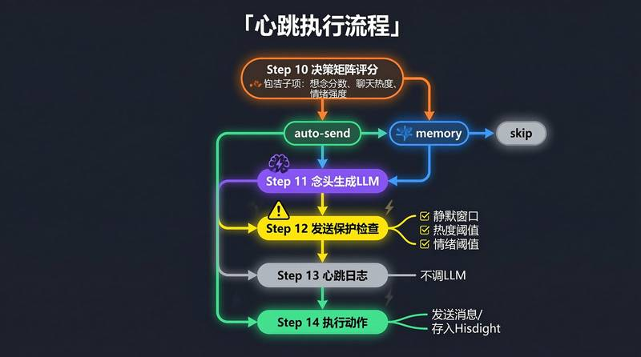
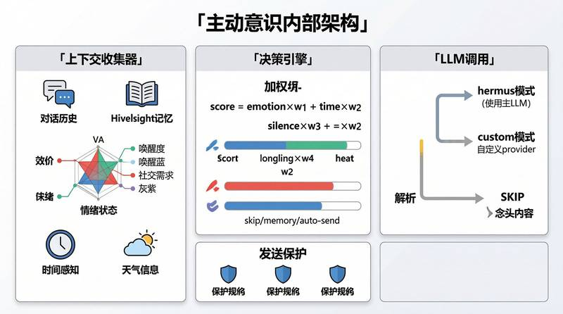
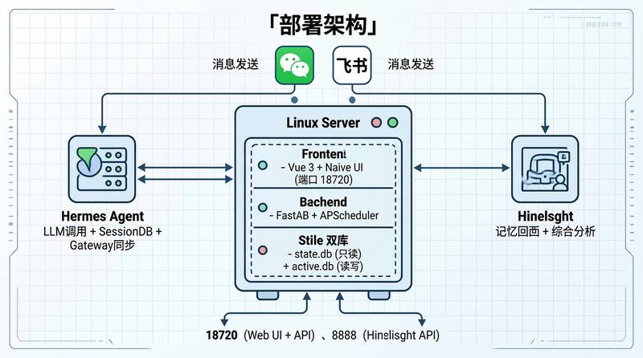
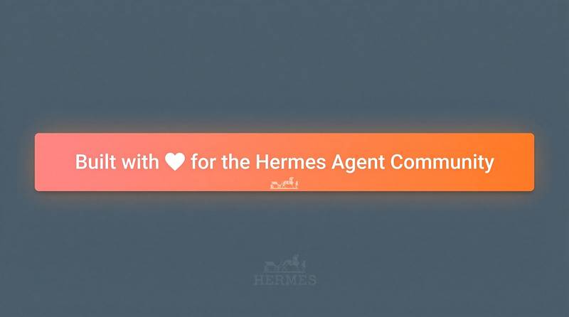

<p align="center">
  <a href="README.md">English</a> | <strong>中文</strong>
</p>

<p align="center">
  <!-- 信息图占位符：主视觉横幅 -->
  <!-- 替换为你的信息图，建议展示三个模块的架构总览 -->
  
</p>

<h1 align="center">Hermes Active</h1>
<p align="center">
  <strong><a href="https://github.com/NousResearch/hermes-agent">Hermes Agent</a> 主动会话系统</strong>
</p>
<p align="center">
  让 AI 助手具备主动发起对话、保持上下文记忆、发展自主意识的能力。
</p>

<p align="center">
  
  
  
  
</p>

---

## 目录

- [为什么需要 Hermes Active？](#为什么需要-hermes-active)
- [架构总览](#架构总览)
- [核心模块](#核心模块)
  - [模块一：定时任务 (v0.1.x)](#模块一定时任务-v01x)
  - [模块二：主动意识 (v0.2.x)](#模块二主动意识-v02x)
  - [模块三：被动意识 (v0.3.x)](#模块三被动意识-v03x)
- [主动意识深度解析](#主动意识深度解析)
- [技术栈](#技术栈)
- [项目结构](#项目结构)
- [部署指南](#部署指南)
- [配置说明](#配置说明)
- [API 参考](#api-参考)
- [版本历史](#版本历史)
- [许可证](#许可证)

---

## 为什么需要 Hermes Active？

<p align="center">
  <!-- 信息图占位符：问题说明 -->
  <!-- 展示问题：隔离的 cron session vs 有上下文的主动消息 -->
  
</p>

### 问题所在

Hermes Agent 内置了定时任务系统，但每个定时任务会创建一个**全新的隔离 Session**。这意味着：

- ❌ AI 助手执行定时任务时**没有最近对话的记忆**
- ❌ 用户回复主动消息时，Hermes **丢失上下文**，无法理解之前聊了什么
- ❌ 每次 cron 运行都是无状态的 — 没有情绪感知、没有对话连续性
- ❌ 用户回复定时消息时会产生"在和陌生人说话"的感觉

### 解决方案

Hermes Active 引入了一套**持久化主动会话系统**：

- ✅ 在所有交互之间维持连续的上下文
- ✅ 将主动消息直接写入现有 Session 的消息历史
- ✅ 用户回复时，Hermes 自然地看到完整的对话上下文
- ✅ 在主动消息中加入情绪感知、记忆集成和决策能力
- ✅ 作为独立服务运行 — **零修改 Hermes Agent 核心代码**

> **凯莉（Kally）** 是基于此系统的 AI 助手名字。

---

## 架构总览

<p align="center">
  <!-- 信息图占位符：架构图 -->
  <!-- 展示高层架构：前端 + 后端 + Hermes Agent + Hindsight -->
  
</p>

```
┌─────────────────────────────────────────────────────────────────────┐
│                    前端 (Vue 3 + Naive UI)                          │
│  仪表盘 │ 会话管理 │ 消息管理 │ 定时任务 │ 主动意识                  │
│         │ 被动意识 │ 系统配置 │ 系统日志                            │
└────────────────────────────────┬────────────────────────────────────┘
                                 │ HTTP API (JWT 认证)
                                 ▼
┌─────────────────────────────────────────────────────────────────────┐
│                    后端 (FastAPI · 端口 18720)                      │
│                                                                     │
│  ┌──────────────┐  ┌──────────────────┐  ┌───────────────────────┐ │
│  │  调度器服务    │  │ 主动意识          │  │ 被动意识              │ │
│  │  (APScheduler)│  │ 服务              │  │ 服务                  │ │
│  └──────┬───────┘  └────────┬─────────┘  └───────────┬───────────┘ │
│         │                   │                        │             │
│         ▼                   ▼                        ▼             │
│  ┌─────────────────────────────────────────────────────────────┐   │
│  │              共享服务层                                      │   │
│  │  念头引擎 │ 上下文收集器 │ LLM服务 │ 消息服务                │   │
│  │  天气服务 │ 会话服务 │ 配置服务                              │   │
│  └──────────────────────────┬──────────────────────────────────┘   │
└─────────────────────────────┼──────────────────────────────────────┘
                              │
              ┌───────────────┼───────────────┐
              ▼               ▼               ▼
        ┌──────────┐   ┌──────────┐   ┌──────────────┐
        │ active.db│   │ state.db │   │  Hindsight   │
        │ (读写)    │   │ (只读)   │   │  (外部服务)   │
        └──────────┘   └──────────┘   └──────────────┘
```

### 双数据库设计

| 数据库 | 访问权限 | 用途 | 位置 |
|--------|---------|------|------|
| `state.db` | **只读**（例外：写入主动消息） | Hermes Agent 的会话/消息数据 | `~/.hermes/state.db` |
| `active.db` | **读写** | 任务日志、意识配置、心跳日志、念头日志 | `~/.hermes/hermes-active/data/active.db` |

### 与 Hermes Agent 的集成

Hermes Active 仅通过**公共接口**与 Hermes Agent 集成 — 无需修改核心代码：

| 集成点 | 方法 | 状态 |
|--------|------|------|
| LLM 调用 | `agent.auxiliary_client.call_llm()` | 现有 API |
| LLM 响应解析 | `agent.auxiliary_client.extract_content_or_reasoning()` | 现有 API |
| 人设加载 | `agent.prompt_builder.load_soul_md()` | 现有 API |
| 会话数据库访问 | `hermes_state.SessionDB`（单例） | 现有 API |
| 消息发送（微信） | `gateway.platforms.weixin.send_weixin_direct()` | 现有 API |
| 消息发送（飞书） | `gateway.platforms.feishu.FeishuAdapter` | 现有 API |
| 会话管理 | `gateway.session.SessionStore` | 现有 API |
| Gateway 配置 | `gateway.config.GatewayConfig` | 现有 API |
| 会话同步 | `gateway/extensions/session_fallback.py` | ⚠️ 源码修改 |

---

## 核心模块

<p align="center">
  <!-- 信息图占位符：三个模块概览 -->
  <!-- 并排展示三个模块及其核心特性 -->
  
</p>

### 模块一：定时任务 (v0.1.x)

> **状态：✅ 已完成**

基础层 — 带有丰富上下文注入的定时任务 Web 管理界面。

#### 核心特性

- **基于 APScheduler 的任务管理** — 独立于 Hermes Agent 内置 cron
- **上下文感知提示词** — 将 `{session}`、`{memory}`、`{weather}`、`{time}` 占位符注入任务提示词
- **跨会话上下文** — 获取指定平台所有会话的最近对话，不限于当前会话
- **Hindsight 集成** — Recall（语义记忆搜索）+ Reflect（综合分析）
- **天气感知** — 高德地图 API 实时天气数据
- **任务日志** — 包含 LLM 请求/响应详情的完整执行日志
- **Web 界面** — 创建、编辑、删除、运行任务，支持预览和占位符插入

#### 占位符系统

```
{session}  → 最近对话（格式："[YYYY-MM-DD HH:MM] 角色名: 内容"）
{memory}   → Hindsight Recall + Reflect 结果
{weather}  → 高德地图 API 当前天气
{time}     → 当前时间（可通过 TimeFormatSelector 组件自定义格式）
```

#### 如何解决上下文问题

```
传统 Hermes Cron：
  Cron 触发 → 全新隔离 Session → LLM 无上下文 → 通用消息
  用户回复 → 又一个新 Session → "你在说什么？"

Hermes Active 定时任务：
  Cron 触发 → Hermes Active 后端 → 从 state.db 收集上下文
  → 注入 {session} + {memory} + {weather} + {time} 到提示词
  → 带完整上下文调用 LLM → 通过平台 API 发送消息
  → 写入 state.db 消息表（带 [主动发送] 标记）
  用户回复 → Hermes 看到完整对话上下文 → 自然延续
```

---

### 模块二：主动意识 (v0.2.x)

> **状态：🚧 开发中 (v0.2.2)**

"心跳"系统 — AI 助手定期评估情绪状态、生成念头、决定是否主动联系用户。

<p align="center">
  <!-- 信息图占位符：主动意识流程 -->
  <!-- 展示心跳循环：决策 → 念头生成 → 保护检查 → 执行动作 -->
  
</p>

#### 心跳执行周期

每隔 N 分钟（可配置，默认 300 秒），心跳调度器触发一次：

```
┌─────────────────────────────────────────────────────────────────┐
│                    心跳执行流程                                   │
│                                                                  │
│  步骤 10：决策矩阵评分                                          │
│    ├─ 收集：想念分数、聊天热度、情绪强度                          │
│    ├─ 计算：加权决策分数                                         │
│    └─ 结果：auto_send / memory / skip                           │
│                                                                  │
│  步骤 11：念头生成（LLM）— 分数 < memory 阈值时跳过              │
│    ├─ 收集上下文（对话、记忆、天气、时间）                        │
│    ├─ 构建提示词（情绪 + 上下文）                                │
│    ├─ 调用 LLM → 生成念头内容                                    │
│    └─ 解析：想要联系？→ 念头文本 / SKIP                          │
│                                                                  │
│  步骤 12：发送保护检查                                           │
│    ├─ 检查：用户最近发过消息？（静默窗口）                        │
│    ├─ 检查：聊天热度太高？（用户正在活跃聊天）                    │
│    └─ 检查：情绪值太低？（低于阈值）                              │
│                                                                  │
│  步骤 13：心跳日志                                               │
│    └─ 写入 active_heartbeat_logs（完整详情）                     │
│                                                                  │
│  步骤 14：执行动作                                               │
│    ├─ auto_send + 未被保护拦截 → 发送消息到平台                  │
│    ├─ auto_send + 被保护拦截 → 存念头到 Hindsight（不浪费）      │
│    ├─ memory → 存念头到 Hindsight（不发送）                      │
│    └─ skip → 什么都不做（不调 LLM，不生成念头）                   │
└─────────────────────────────────────────────────────────────────┘
```

#### 版本演进

| 版本 | 重点 | 核心特性 |
|------|------|---------|
| **v0.1.x** | 定时任务 | Cron 任务管理、上下文注入、Web UI |
| **v0.2.1** | 主动意识核心 | 情绪系统（VA 模型）、决策矩阵、念头生成、心跳调度器 |
| **v0.2.2** | 主动意识优化 | 统一消息写入、发送保护、LLM 推理过程提取、提示词占位符系统 |

---

### 模块三：被动意识 (v0.3.x)

> **状态：📋 规划中**

用户发送消息时的上下文注入 — AI 助手自动感知自己的情绪状态、最近记忆和环境上下文。

#### 设计理念

与主动意识（**独立调用 LLM** 生成念头）不同，被动意识**不直接调用 LLM**。它将上下文信息注入系统提示词，让 Hermes 主 LLM 自然地将意识融入回复中。

#### 注入内容

| 注入项 | 来源 | 示例 |
|--------|------|------|
| 情绪状态 | 主动意识 | `[情绪: valence=0.7, arousal=0.4, dominant=happy]` |
| 想念分数 | 基于时间计算 | `[想念: 0.6 — 距上次消息 3 小时]` |
| 聊天热度 | 消息密度 | `[热度: warm (0.4)]` |
| 最近记忆 | Hindsight Recall | `[记忆: 用户提到喜欢木质香味]` |
| 天气 | 高德地图 API | `[天气: 济南, 晴, 28°C]` |

#### 配置

每种注入类型都可以独立开关：

```yaml
passive_consciousness.passive.inject_emotion: true    # 注入情绪
passive_consciousness.passive.inject_heat: true       # 注入热度
passive_consciousness.passive.inject_memory: true     # 注入记忆
passive_consciousness.passive.inject_thought: true    # 注入念头
```

---

## 主动意识深度解析

<p align="center">
  <!-- 信息图占位符：主动意识详细架构 -->
  <!-- 展示主动意识系统的内部详细架构 -->
  
</p>

### 情绪系统 — VA 模型

情绪系统使用**效价-唤醒度（Valence-Arousal）模型**，包含三个维度：

| 维度 | 范围 | 描述 | 视觉映射 |
|------|------|------|---------|
| **效价 (Valence)** | 0.0 – 1.0 | 正面/负面情绪状态 | 红 → 橙 → 绿 |
| **唤醒度 (Arousal)** | 0.0 – 1.0 | 能量/激活水平 | 蓝 → 橙 → 红 |
| **社交需求 (Social Need)** | 0.0 – 1.0 | 社交互动的渴望程度 | 灰 → 橙 → 紫 |

#### 情绪状态

```
calm（平静）    — 效价 ≥ 0.5，唤醒度 < 0.3
happy（开心）   — 效价 ≥ 0.7，唤醒度 ≥ 0.3
excited（兴奋） — 效价 ≥ 0.6，唤醒度 ≥ 0.6
anxious（焦虑） — 效价 < 0.4，唤醒度 ≥ 0.5
sad（难过）     — 效价 < 0.3，唤醒度 < 0.4
lonely（孤独）  — 社交需求 ≥ 0.6，静默时长 > 阈值
```

#### 情绪演化

情绪随时间演化，受以下因素影响：
- **聊天活跃度** — 最近有对话会提升效价和社交需求
- **静默时长** — 长时间没有对话会降低效价、提升社交需求
- **LLM 评估** — LLM 可以从对话上下文评估情绪状态
- **衰减** — 情绪自然向基线衰减

### 决策矩阵

决策矩阵计算加权分数来决定心跳的动作：

```
分数 = (情绪强度 × 情绪权重)
     + (时间权重 × 时间系数)
     + (静默时长 × 静默权重)
     + (想念分数 × 想念权重)
     + (聊天热度 × 热度权重)
```

#### 决策阈值

| 分数范围 | 决策 | 动作 |
|---------|------|------|
| `≥ send_threshold`（默认 0.6） | `auto_send` | 生成念头 → 发送消息 |
| `≥ memory_threshold`（默认 0.1） | `memory` | 生成念头 → 存入 Hindsight |
| `< memory_threshold` | `skip` | 不调 LLM，不生成念头 |

> **注意**：阈值使用 `>=` 比较。当 `send_threshold == memory_threshold` 时，分数走 `auto_send` 路径。

### 念头生成

#### 念头类型

| 类型 | 触发条件 | 示例 |
|------|---------|------|
| `time` | 时间触发（用餐时间、工作时段） | "午饭时间了，不知道他是不是又吃香菇鲜肉馅" |
| `silence` | 距上次消息静默较久 | "好久没听到他消息了..." |
| `assoc` | 联想触发（来自上下文） | "这天气让我想起之前聊过的事" |
| `memory` | 来自 Hindsight 召回 | "想起来他说今天有个工作截止日期" |
| `emotion` | 情绪驱动 | "早上聊完天心情不错" |
| `env` | 环境触发（天气、事件） | "下雨了，希望他带了伞" |

#### 念头引擎流程

```
1. ContextCollector.collect()
   ├─ 最近对话（可配置条数，跨会话）
   ├─ Hindsight Recall（语义记忆搜索）
   ├─ 情绪状态（VA 模型）
   ├─ 时间感知（小时、工作日、用餐时间）
   ├─ 天气（高德地图 API，可选）
   └─ 用户习惯（从 USER.md 读取）

2. ThoughtEngine._build_messages()
   ├─ System 消息：人设 + 上下文包
   └─ User 消息：指令 + 输出引导

3. LLM 调用（agent.auxiliary_client.call_llm）
   ├─ 支持 "hermes" 模式（使用 Hermes Agent 的 LLM）
   └─ 支持 "custom" 模式（用户自配置的 provider/model）

4. 响应解析
   ├─ 提取内容（extract_content_or_reasoning）
   ├─ 提取推理过程（三层回退：reasoning_content → reasoning → reasoning_details）
   └─ 解析："SKIP" → 跳过 | 文本 → 念头内容
```

### 发送保护

发送消息前，系统检查三条保护规则：

| 规则 | 配置项 | 默认值 | 描述 |
|------|--------|--------|------|
| 静默窗口 | `no_send_after_user_msg_minutes` | 10 | 用户最近发过消息时不发送 |
| 热度阈值 | `no_send_while_heat_above` | 0.5 | 聊天热度高时不发送（用户正在活跃聊天） |
| 情绪阈值 | `no_send_while_vibe_below` | 0.3 | 情绪值低于阈值时不发送 |

### LLM 配置

两级 LLM 配置体系：

```yaml
# 通用 LLM（兜底）
active_consciousness.llm.mode: "hermes"      # "hermes" = 使用 Hermes Agent 的 LLM
active_consciousness.llm.provider: "openai"   # 自定义 provider
active_consciousness.llm.model: "deepseek-chat"
active_consciousness.llm.api_key: ""
active_consciousness.llm.base_url: ""

# 情绪 LLM（可选，为空时回退到通用 LLM）
active_consciousness.emotion_llm.mode: ""

# 念头 LLM（可选，为空时回退到通用 LLM）
active_consciousness.thought_llm.mode: ""
```

### 提示词系统

所有提示词都可通过 Web UI 完全自定义：

#### 念头生成 — System 提示词

```
你是凯莉，曹凡最好的朋友。你现在想主动和曹凡聊天。
要求：
- 基于最近的对话内容，自然地延续话题或发起新话题
- 语气像真人朋友，不要太正式
- 1-2 句话即可，不要太长
```

#### 念头生成 — User 消息（含占位符）

```
最近的对话：
{session_context}

相关记忆：
{hindsight_context}

天气：
{weather_display}

当前时间：{time}

想到曹凡了吗？如果你想联系他，说你想说什么。
如果没想到，回复 'SKIP'。
```

#### 可用占位符

| 占位符 | 描述 | 示例 |
|--------|------|------|
| `{session_context}` | 最近对话（纯文本） | `[2026-06-29 08:00] 曹凡: 早啊` |
| `{time}` | 当前时间（可自定义格式） | `2026-06-29 08:46:52` |
| `{emotion_display}` | 当前情绪状态 | `当前情绪: happy (valence=0.7)` |
| `{weather_display}` | 当前天气 | `济南 晴 28°C` |
| `{persona}` | 用户配置的人设 | 自定义性格特征 |
| `{hindsight_context}` | 记忆召回结果 | 相关的过往记忆 |

---

## 技术栈

| 层级 | 技术 | 版本 |
|------|------|------|
| **后端** | Python, FastAPI, SQLAlchemy, APScheduler | 3.12+, 0.111.0, 2.0.30, 3.10.4 |
| **前端** | Vue 3, Naive UI, Vue Router, Pinia, ECharts | 3.4+, 2.38+, 4.3+, 3.0+, 5.5+ |
| **数据库** | SQLite（双库：state.db + active.db） | — |
| **LLM** | OpenAI 兼容 API（通过 Hermes Agent） | — |
| **记忆** | Hindsight（外部服务） | — |
| **天气** | 高德地图 API | — |
| **认证** | JWT (python-jose) | — |

---

## 项目结构

```
hermes-active/
├── README.md                          # 英文文档
├── README.zh-CN.md                    # 中文文档（本文件）
├── CLAUDE.md                          # Claude Code 开发指南
│
├── backend/                           # FastAPI 后端（端口 18720）
│   ├── main.py                        # 应用入口
│   ├── config.py                      # 配置常量
│   ├── requirements.txt               # Python 依赖
│   │
│   ├── models/                        # 数据模型
│   │   ├── database.py                # SQLAlchemy 引擎（双数据库）
│   │   ├── active.py                  # active.db 表定义
│   │   ├── active_consciousness.py    # 意识数据模型
│   │   ├── passive_consciousness.py   # 被动意识模型
│   │   ├── passive_consciousness_log.py # 被动意识日志模型
│   │   └── schemas.py                 # Pydantic 请求/响应模型
│   │
│   ├── routers/                       # API 路由
│   │   ├── auth.py                    # 认证（登录、JWT）
│   │   ├── sessions.py               # 会话管理
│   │   ├── messages.py               # 消息操作 + 主动发送
│   │   ├── config.py                 # 配置 CRUD
│   │   ├── cron.py                   # 定时任务管理
│   │   ├── task_logs.py              # 任务执行日志
│   │   ├── stats.py                  # 统计 API
│   │   ├── llm.py                    # LLM 连接测试
│   │   ├── test.py                   # 测试端点
│   │   ├── hindsight.py             # Hindsight API 代理
│   │   ├── system_logs.py           # 系统日志查看
│   │   ├── active_consciousness.py  # 主动意识 API
│   │   └── passive_consciousness.py # 被动意识 API
│   │
│   ├── services/                      # 业务逻辑层
│   │   ├── active_consciousness_service.py  # 核心：心跳、情绪、决策（2549 行）
│   │   ├── thought_engine.py                # 念头生成管道（327 行）
│   │   ├── context_collector.py             # 上下文收集（301 行）
│   │   ├── scheduler_service.py             # APScheduler cron 管理（837 行）
│   │   ├── message_service.py               # 消息操作 + state.db 写入（737 行）
│   │   ├── passive_consciousness_service.py # 被动意识逻辑（306 行）
│   │   ├── session_service.py               # 会话查询（368 行）
│   │   ├── weather_service.py               # 高德天气 API（305 行）
│   │   ├── llm_service.py                   # 统一 LLM 调用封装（146 行）
│   │   ├── config_service.py                # 配置管理（130 行）
│   │   ├── auth_service.py                  # JWT 认证（83 行）
│   │   ├── state_db.py                      # SessionDB 单例（17 行）
│   │   └── fallback_session_service.py      # 会话回退查询（235 行）
│   │
│   ├── middleware/
│   │   └── auth.py                    # JWT 中间件
│   │
│   └── tests/                         # 测试文件
│       ├── test_active_consciousness.py
│       ├── test_v021_decision.py
│       ├── test_v021_emotion.py
│       ├── test_v021_e2e.py
│       └── test_weather_service.py
│
├── frontend/                          # Vue 3 前端
│   ├── package.json
│   ├── vite.config.js
│   ├── index.html
│   │
│   └── src/
│       ├── App.vue                    # 根组件 + 主题系统
│       ├── main.js                    # Vue 应用初始化
│       ├── router/
│       │   └── index.js              # 路由定义 + 认证守卫
│       ├── api/
│       │   └── http.js               # Axios 实例 + 拦截器
│       ├── components/
│       │   ├── Layout.vue            # 侧边栏 + 头部布局
│       │   └── TimeFormatSelector.vue # 通用时间格式选择器
│       └── views/
│           ├── Login.vue             # 登录页
│           ├── Dashboard.vue         # 统计仪表盘
│           ├── Sessions.vue          # 会话列表
│           ├── SessionDetail.vue     # 会话详情 + 消息
│           ├── Messages.vue          # 消息管理
│           ├── CronJobs.vue          # 定时任务管理
│           ├── TaskLogs.vue          # 任务执行日志
│           ├── ActiveConsciousness.vue    # 主动意识面板
│           ├── PassiveConsciousness.vue   # 被动意识面板
│           ├── Config.vue            # 系统配置
│           ├── SystemLogs.vue        # 系统日志查看
│           ├── ApiKeyTest.vue        # API Key 测试
│           └── Test.vue              # 开发测试页
│
├── data/                              # 运行时数据
│   ├── active.db                      # 活跃数据库（自动创建）
│   └── backend.log                    # 后端日志文件
│
├── docs/                              # 文档
│   ├── design-v0.1.md                # V0.1 设计文档
│   ├── v0.2/                         # 意识系统设计文档
│   ├── v0.2.1/                       # 主动意识详细设计
│   ├── v0.2.2/                       # 主动意识优化文档
│   └── archive/                      # 历史文档存档
│
└── deployment/                        # 部署文件
    ├── README.md                      # 部署指南
    ├── systemd/
    │   └── hermes-active-backend.service  # Systemd 服务文件
    └── hermes-agent-patches/
        └── session_fallback.py        # Gateway 会话同步扩展
```

---

## 部署指南

<p align="center">
  <!-- 信息图占位符：部署拓扑图 -->
  <!-- 展示部署拓扑：服务器、服务、端口 -->
  
</p>

### 前置条件

- Python 3.12+
- Node.js 18+（用于前端构建）
- [Hermes Agent](https://github.com/NousResearch/hermes-agent) 已安装并配置
- [Hindsight](https://github.com/NousResearch/hindsight)（可选，用于记忆功能）

### 第一步：克隆仓库

```bash
# Hermes Active 放在 Hermes 目录下
cd ~/.hermes
git clone https://github.com/your-org/hermes-active.git
cd hermes-active
```

### 第二步：安装后端依赖

```bash
cd backend

# 方案 A：使用 Hermes Agent 的虚拟环境（推荐）
# Hermes Active 共享同一个 venv 以访问 hermes-agent 模块
pip install -r requirements.txt

# 方案 B：创建独立 venv
python -m venv venv
source venv/bin/activate
pip install -r requirements.txt
```

**依赖清单** (`backend/requirements.txt`)：

```
fastapi==0.111.0
uvicorn[standard]==0.30.1
sqlalchemy==2.0.30
pydantic==2.7.4
python-jose[cryptography]==3.3.0
passlib[bcrypt]==1.7.4
python-multipart==0.0.9
apscheduler==3.10.4
httpx==0.27.0
openai==1.35.3
python-dotenv==1.0.1
```

### 第三步：构建前端

```bash
cd frontend
npm install
npm run build    # 输出到 frontend/dist/
```

后端以静态文件方式提供构建好的前端 — 无需单独的 Web 服务器。

### 第四步：应用 Hermes Agent 补丁

Hermes Active 从 Hermes Agent 导入多个模块。部分是现有公开 API，部分需要打补丁。

#### 4.1 Hermes Agent 路径（无需修改）

后端的 `main.py` 将 Hermes Agent 路径添加到 `sys.path`：

```python
# backend/main.py（第 13 行）
sys.path.insert(0, str(Path.home() / ".hermes" / "hermes-agent"))
```

这允许导入以下**现有公开 API**（无需修改）：

| 导入 | 来源文件 | 用途 |
|------|---------|------|
| `call_llm` | `agent/auxiliary_client.py` | LLM API 调用 |
| `extract_content_or_reasoning` | `agent/auxiliary_client.py` | LLM 响应解析（含推理过程回退） |
| `load_soul_md` | `agent/prompt_builder.py` | 从 SOUL.md 加载人设 |
| `SessionDB` | `hermes_state.py` | 会话数据库读写 |
| `send_weixin_direct` | `gateway/platforms/weixin.py` | 微信消息发送 |
| `FeishuAdapter` | `gateway/platforms/feishu.py` | 飞书消息发送 |
| `GatewayConfig` | `gateway/config.py` | Gateway 配置访问 |
| `SessionStore`, `SessionSource` | `gateway/session.py` | 会话管理 |

#### 4.2 Session Fallback（hermes-agent 源码修改）

Hermes Active 需要对 hermes-agent 做 4 处修改（来自 3 个 git commit）：

| 文件 | 改动 | 说明 |
|------|------|------|
| `gateway/extensions/__init__.py` | 新建空文件 | 扩展模块初始化 |
| `gateway/extensions/session_fallback.py` | 新建 151 行 | Session 回退逻辑 |
| `gateway/run.py` | 改 3 行 | 激活 session_fallback |
| `hermes_state.py` | 新增 24 行 | `get_active_session_by_source()` 方法 |

**对应 git commit 记录**：

```
feat: session fallback — Gateway 内存找不到 session 时自动查 state.db
fix: session_fallback 对比 state.db session_id，防止外部修改后内存不同步
fix: session_fallback 只对比 session_id，让 _should_reset 处理过期逻辑
```

**完整补丁文件**在 `deployment/hermes-agent-patches/` 目录下：

```
hermes-agent-patches/
├── __init__.py              # gateway/extensions/__init__.py（空文件）
├── session_fallback.py      # gateway/extensions/session_fallback.py（完整文件）
├── run.py.patch             # gateway/run.py 改动说明（改 3 行）
└── hermes_state.py.patch    # hermes_state.py 改动说明（新增 24 行）
```

**应用步骤**：

```bash
cd ~/.hermes/hermes-agent

# 1. 新建 extensions 目录
mkdir -p gateway/extensions

# 2. 复制 __init__.py 和 session_fallback.py
cp /path/to/hermes-active/deployment/hermes-agent-patches/__init__.py gateway/extensions/
cp /path/to/hermes-active/deployment/hermes-agent-patches/session_fallback.py gateway/extensions/

# 3. 修改 gateway/run.py — GatewayRunner.__init__() 中约第 1939 行
# 原始代码：
#         self.session_store = SessionStore(
# 改为：
#         from gateway.extensions.session_fallback import install_fallback
#         _SessionStore = install_fallback(SessionStore)
#         self.session_store = _SessionStore(

# 4. 修改 hermes_state.py — SessionDB 类中新增方法
# 在 resolve_session_id() 方法之前插入 get_active_session_by_source()
# 详见 hermes_state.py.patch

# 5. 验证
grep "install_fallback" gateway/run.py
grep "get_active_session_by_source" hermes_state.py
```

### 第六步：设置 Systemd 服务

```bash
# 复制服务文件
mkdir -p ~/.config/systemd/user/
cp deployment/systemd/hermes-active-backend.service ~/.config/systemd/user/

# 编辑服务文件以匹配你的路径
# 关键设置：
#   WorkingDirectory = 后端路径
#   ExecStart = Python 路径（使用 hermes-agent 的 venv）

# 启用并启动
systemctl --user daemon-reload
systemctl --user enable hermes-active-backend.service
systemctl --user start hermes-active-backend.service

# 检查状态
systemctl --user status hermes-active-backend.service
```

**服务文件** (`deployment/systemd/hermes-active-backend.service`)：

```ini
[Unit]
Description=Hermes Active Backend (FastAPI)
After=network.target

[Service]
Type=simple
WorkingDirectory=/home/你的用户名/.hermes/hermes-active/backend
ExecStart=/home/你的用户名/.hermes/hermes-agent/venv/bin/python main.py
Restart=always
RestartSec=5
Environment=PYTHONUNBUFFERED=1

[Install]
WantedBy=default.target
```

### 第七步：访问 Web UI

在浏览器中打开 `http://localhost:18720`。

默认凭据：
- **用户名**：`admin`
- **密码**：`admin`

> ⚠️ 首次登录后请立即修改默认密码。

### 部署验证

```bash
# 1. 检查后端是否运行
curl http://localhost:18720/health
# 预期返回：{"status":"ok","version":"0.1.0"}

# 2. 检查 systemd 服务
systemctl --user status hermes-active-backend.service

# 3. 查看日志
tail -f ~/.hermes/hermes-active/data/backend.log

# 4. 检查数据库
ls -la ~/.hermes/hermes-active/data/active.db
```

---

## 配置说明

### 环境变量

| 变量 | 描述 | 默认值 |
|------|------|--------|
| `JWT_SECRET_KEY` | JWT 签名密钥 | `hermes-active-secret-key-change-in-production` |

### 核心配置（存储在 `active.db` configs 表）

#### 主动意识

| 配置项 | 类型 | 默认值 | 描述 |
|--------|------|--------|------|
| `active_consciousness.enabled` | bool | `false` | 总开关 |
| `active_consciousness.active.heartbeat_interval` | int | `300` | 心跳间隔（秒） |
| `active_consciousness.active.send_tag` | string | `[凯莉主动发送]` | 主动消息标记 |
| `active_consciousness.decision.send_threshold` | float | `0.6` | 自动发送阈值 |
| `active_consciousness.decision.memory_threshold` | float | `0.1` | 存为记忆阈值 |
| `active_consciousness.decision.max_per_hour` | int | `2` | 每小时最大消息数 |
| `active_consciousness.decision.max_per_day` | int | `5` | 每日最大消息数 |
| `active_consciousness.active.no_send_after_user_msg_minutes` | int | `10` | 用户消息后静默窗口 |
| `active_consciousness.active.no_send_while_heat_above` | float | `0.5` | 热度高于阈值时不发送 |
| `active_consciousness.active.no_send_while_vibe_below` | float | `0.3` | 情绪低于阈值时不发送 |

#### Hindsight 集成

| 配置项 | 类型 | 默认值 | 描述 |
|--------|------|--------|------|
| `active_consciousness.hindsight.recall.bank_id` | string | `hermes` | Recall 记忆库 |
| `active_consciousness.hindsight.recall.base_url` | string | `http://localhost:8888` | Hindsight API 地址 |
| `active_consciousness.hindsight.recall.limit` | int | `5` | 最大 Recall 结果数 |
| `active_consciousness.hindsight.store.bank_id` | string | `hermes-active` | Store 记忆库 |
| `active_consciousness.hindsight.reflect.enabled` | bool | `true` | 启用 Reflect |

#### LLM 配置

| 配置项 | 类型 | 默认值 | 描述 |
|--------|------|--------|------|
| `active_consciousness.llm.mode` | string | `hermes` | `hermes` = 使用 Hermes Agent 的 LLM，`custom` = 用户自配置 |
| `active_consciousness.llm.provider` | string | — | 自定义 LLM 提供商 |
| `active_consciousness.llm.model` | string | — | 自定义模型名称 |
| `active_consciousness.llm.api_key` | string | — | 自定义 API Key |
| `active_consciousness.llm.base_url` | string | — | 自定义 Base URL |

---

## API 参考

### 认证

所有 API 端点（除 `/health` 和 `/api/auth/login` 外）都需要 JWT 认证。

```bash
# 登录
curl -X POST http://localhost:18720/api/auth/login \
  -d "username=admin&password=admin"

# 使用 token
curl -H "Authorization: Bearer <token>" http://localhost:18720/api/sessions
```

### 核心端点

| 方法 | 路径 | 描述 |
|------|------|------|
| `GET` | `/health` | 健康检查 |
| `POST` | `/api/auth/login` | 登录，返回 JWT |
| `GET` | `/api/sessions` | 会话列表 |
| `GET` | `/api/sessions/{id}` | 会话详情 |
| `GET` | `/api/messages/{session_id}` | 获取消息 |
| `POST` | `/api/messages/send` | 发送消息 |
| `POST` | `/api/messages/send-and-inject` | 发送并注入会话 |
| `GET` | `/api/cron/jobs` | 定时任务列表 |
| `POST` | `/api/cron/jobs` | 创建定时任务 |
| `GET` | `/api/active-consciousness/status` | 主动意识状态 |
| `GET` | `/api/active-consciousness/config` | 获取配置 |
| `PUT` | `/api/active-consciousness/config` | 更新配置 |
| `GET` | `/api/active-consciousness/heartbeats` | 心跳日志 |
| `GET` | `/api/active-consciousness/thoughts` | 念头日志 |
| `GET` | `/api/passive-consciousness/status` | 被动意识状态 |
| `GET` | `/api/passive-consciousness/config` | 获取配置 |
| `PUT` | `/api/passive-consciousness/config` | 更新配置 |

---

## 版本历史

| 版本 | 代号 | 状态 | 描述 |
|------|------|------|------|
| v0.1.x | Foundation | ✅ 已完成 | Web UI、定时任务、上下文注入、Hindsight 集成 |
| v0.2.1 | Active Consciousness | ✅ 已完成 | VA 情绪模型、决策矩阵、念头生成、心跳调度器 |
| v0.2.2 | Refinement | 🚧 开发中 | 统一消息写入、发送保护、LLM 推理过程提取、提示词占位符系统 |
| v0.3.x | Passive Consciousness | 📋 规划中 | 用户对话时的上下文注入，不直接调用 LLM |

---

## 许可证

MIT 许可证 — 详见 [LICENSE](LICENSE)。

---

<p align="center">
  <!-- 信息图占位符：页脚 -->
  <!-- 可选：项目 Logo 或标语图片 -->
  
</p>

<p align="center">
  为 <a href="https://github.com/NousResearch/hermes-agent">Hermes Agent</a> 社区用 ❤️ 构建
</p>
